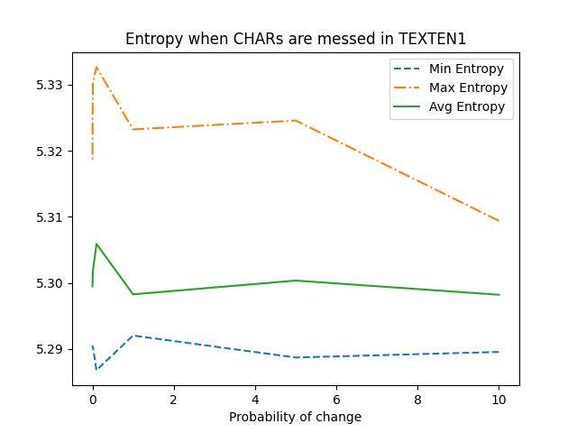

# Task N1. Entropy of a Text
## Task N1.1 Compute this conditional entropy and perplexity for the file TEXTEN1.txt
Number of unique words in texten1 9607
Number of unique words in textcz1 42826
Conditional entropy for English 5.287480117645905
Perplexity for English PX = 39.0562117685497
Conditional entropy for Czech 4.747789344091995
Perplexity for Czech PX = 26.86748441730447
## Task N1.2 Mess up with text and measure how it affects entropy for the file TEXTEN1.txt
### Entropies of texten1 with messed CHARs
|      Probability, %      |       Min Entropy        |       Max Entropy        |       Avg Entropy        |
| ------------------------ | ------------------------ | ------------------------ | ------------------------ |
| 10                       | 5.2895461196646         | 5.309390150319673       | 5.298204838998885        |
| 5                        | 5.288703408636961       | 5.324575994174408       | 5.300350520740733        |
| 1                        | 5.2920316986689055      | 5.323238278107056       | 5.298267292282641        |
| 0.1                      | 5.286780478666108       | 5.332666830617948       | 5.305897896482298        |
| 0.01                     | 5.290398707296836       | 5.330371910034106       | 5.301742289065928        |
| 0.001                    | 5.290203717043805       | 5.318305442610234       | 5.299475368119893        |

### Entropies of texten1 with messed WORDs
|      Probability, %      |       Min Entropy        |       Max Entropy        |       Avg Entropy        |
| ------------------------ | ------------------------ | ------------------------ | ------------------------ |
| 10                       | 5.412455941394924       | 5.427148818903633       | 5.420968472212118        |
| 5                        | 5.414719342925983       | 5.4300635650587905      | 5.422083424714532        |
| 1                        | 5.416413836766047       | 5.434715654260593       | 5.422647468503018        |
| 0.1                      | 5.417395780859448       | 5.430366776770127       | 5.425335438471494        |
| 0.01                     | 5.417300545450248       | 5.426614760414595       | 5.422195332706909        |
| 0.001                    | 5.413883192791053       | 5.431702883130931       | 5.423727821532589        |

### Entropies of textcz1 with messed CHARs ---
|      Probability, %      |       Min Entropy        |       Max Entropy        |       Avg Entropy        |
| ------------------------ | ------------------------ | ------------------------ | ------------------------ |
| 10                       | 4.760236161985873       | 4.784577059695414       | 4.772834718893179        |
| 5                        | 4.753400298786042       | 4.833709073418793       | 4.782934397412562        |
| 1                        | 4.763236395044169       | 4.849637075338729       | 4.790167440604123        |
| 0.1                      | 4.758033836250656       | 4.794534949234246       | 4.776757638806332        |
| 0.01                     | 4.756325869204823       | 4.8078545269428         | 4.777475034872895        |
| 0.001                    | 4.759940462997428       | 4.800780890154309       | 4.774940250579594        |

### Entropies of textcz1 with messed WORDs
|      Probability, %      |       Min Entropy        |       Max Entropy        |       Avg Entropy        |
| ------------------------ | ------------------------ | ------------------------ | ------------------------ |
| 10                       | 5.03163186858502        | 5.042376585306392       | 5.038620016097987        |
| 5                        | 5.034536652019816       | 5.0435486463896115      | 5.039044773815826        |
| 1                        | 5.033377336228464       | 5.044484079716182       | 5.039400226508779        |
| 0.1                      | 5.035314422954056       | 5.042903178132163       | 5.038964101389995        |
| 0.01                     | 5.03604511471345        | 5.047574142355513       | 5.040572466089326        |
| 0.001                    | 5.031782861587651       | 5.042157388506108       | 5.038576071394454        |

### Entropy when CHARs are messed in TEXTEN1

### Entropy when WORDs are messed in TEXTEN1

### Entropy when CHARs are messed in TEXTCZ1

### Entropy when WORDs are messed in TEXTCZ1

